  <h1>Hi there, I'm Hemaka Wanshanath 👋</h1>

  

    <b>
      Information Systems Undergraduate at UCSC |
      Cloud Computing Enthusiast |
      Multi-Cloud & DevOps Learner
    </b>
  

  

  

 

### 👨‍💻 About Me

- 🎓 Studying **BSc. Information Systems** at the University of Colombo School of Computing (UCSC).
- ☁️ Passionate about bridging business operations with technical infrastructure, specifically focusing on multi-cloud environments and systems optimization.
- 💻 Developed a **Recruitment Management System** as part of my 1st-year Internet and Web Technologies (IWT) coursework.
- 📍 Based in Colombo, Sri Lanka.

---

### 🛠️ Technologies & Tools I'm Exploring

#### ☁️ Cloud & Infrastructure

#### ⚙️ DevOps & Automation

#### 📊 Monitoring & Observability

#### 💻 Programming & Databases

#### 🌐 Web Development

#### 📱 Mobile App Development

#### 🎯 Areas of Interest

`Cloud Engineering` `Cloud Security` `DevOps` `Site Reliability Engineering` `Infrastructure as Code` `CI/CD` `Containerization` `Monitoring & Observability`

### 🏗️ Featured Project

- **[Recruitment Management System](https://github.com/Recruitment-Management-System-IS1207/Client-fe)**

  Collaborative 1st-year project. Developed a web-based system to digitize and streamline candidate recruitment workflows.

  - **Technologies used:** HTML, CSS, JavaScript, PHP.

---

### 📜 Licenses & Certifications

- **Cloud Computing Fundamentals** – *IBM*
- **Fundamentals of Machine Learning and Artificial Intelligence** – *AWS*
- **Linux Unhatched** – *Cisco*
- **Generative AI Overview for Project Managers** – *Project Management Institute (PMI)*
- **Problem Solving (Basic)** – *HackerRank*

---

### 📫 Let's Connect

  

  

